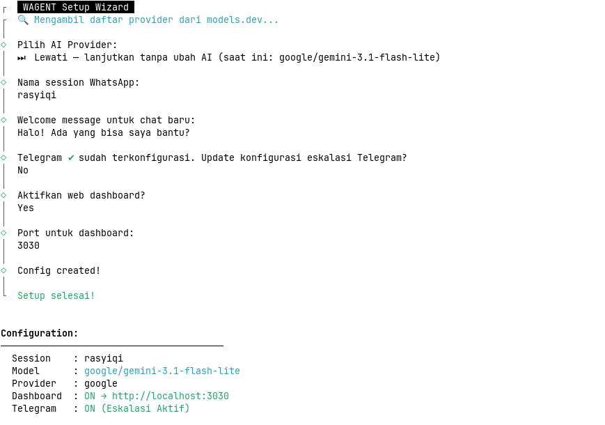
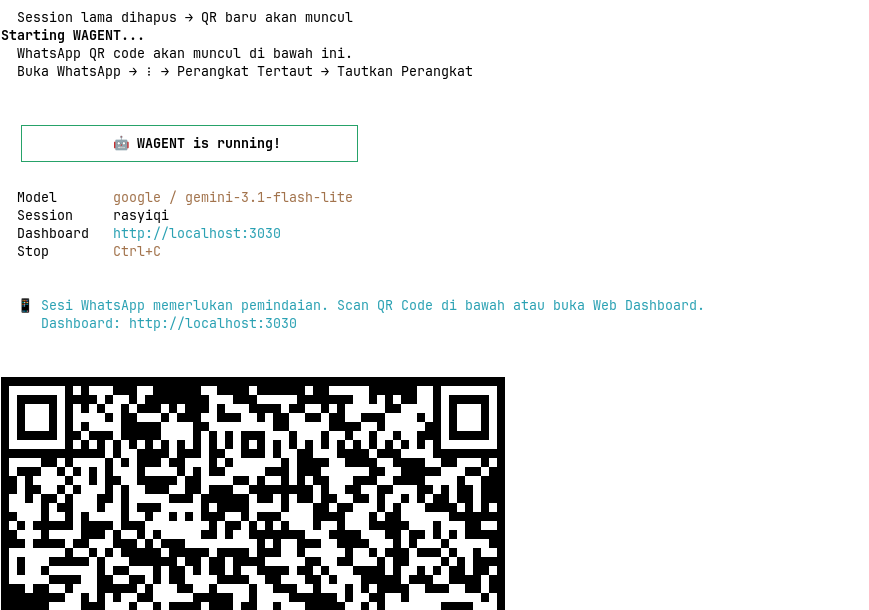
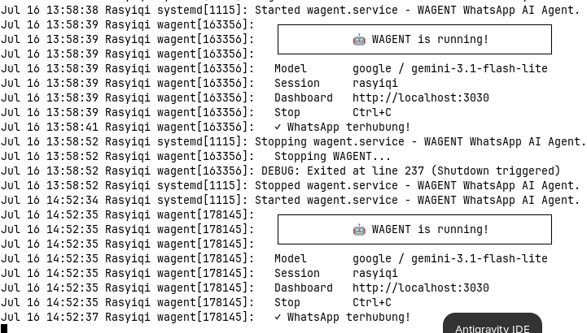
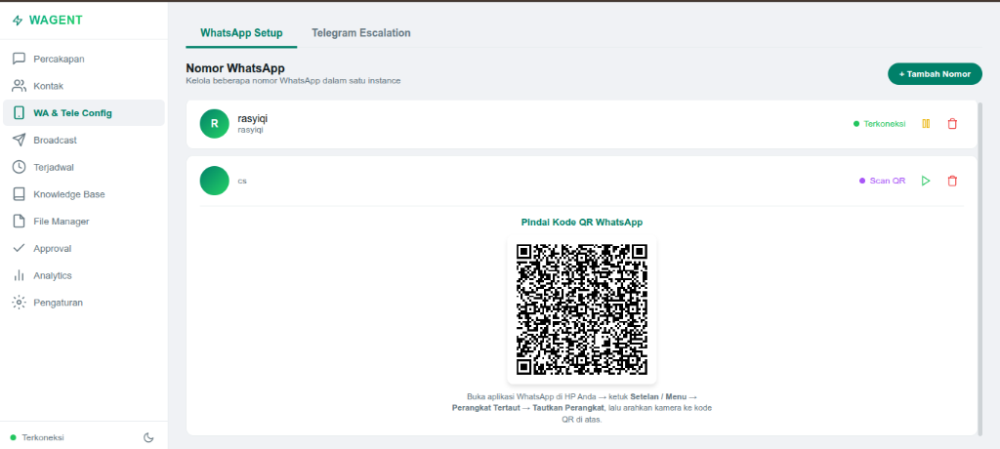
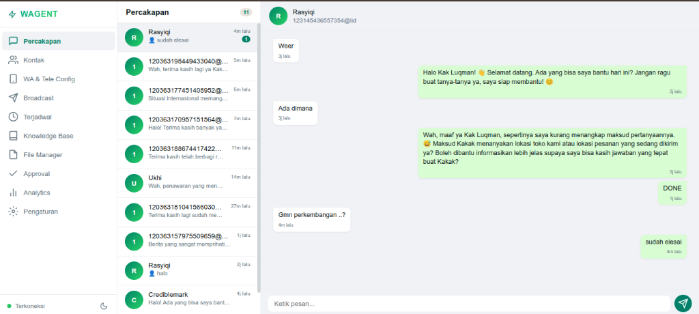
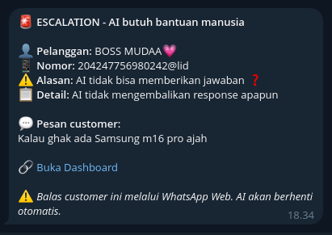

# 🤖 WAGENT — WhatsApp AI Agent Platform

**Open-source, self-hosted, multi-AI WhatsApp agent for everyone.**

[](https://opensource.org/licenses/MIT)
[](https://bun.sh)
[](https://www.typescriptlang.org/)

[🇩🇮 Bahasa Indonesia](README.md) | [🇺🇸 English](README_EN.md)

---

## 🎯 What is WAGENT?

WAGENT is a **WhatsApp AI Agent platform** that anyone can use — personal, professional, business, developer.

- 💬 **Personal AI Assistant** — AI that answers your WhatsApp
- 🛒 **Online Store** — Automated CS, orders, payments
- 🏢 **Business** — Service, booking, consultations
- 🧑‍💻 **Developer** — Build custom AI agents with skills

---

## 📸 Preview / Screenshots

<details>
  <summary><b>View WAGENT Terminal & Web Dashboard Interface</b></summary>
  <br/>
  
  ### 1. TUI Setup Wizard
  Interactive setup wizard in the terminal when running `./bin/wagent init` for the first time.
  
  
  
  ### 2. WhatsApp QR Authentication in Terminal
  Dynamic QR code generated in the terminal to connect your WhatsApp number.
  
  
  
  ### 3. WAGENT Service in Systemd
  Background daemon operational logs when running on a Linux server (`systemctl start wagent`).
  
  
  
  ### 4. WhatsApp Number Configuration (Web Dashboard)
  Settings interface in the Web Dashboard to manage your multi-number WhatsApp integrations.
  
  
  
  ### 5. Conversation History (Web Dashboard)
  Real-time incoming message monitoring interface, where human CS can intervene in conversations.
  
  

  ### 6. Telegram Escalation (Human Help Notifications)
  Real-time notifications sent to Telegram when AI cannot answer customer questions, allowing human agents to take over the conversation.
  
  
</details>

---

## ✨ Features

### Core
| Feature | Description |
|---------|-------------|
| 🧠 **Multi-AI Provider** | OpenAI, Gemini, Claude, or Ollama (local) |
| 📚 **RAG Knowledge Base** | Semantic search + FTS5 for accurate answers |
| 👥 **Multi-Number WhatsApp** | Manage multiple numbers from one instance |
| 🤝 **Human Takeover** | AI automatically stops when a human agent replies |
| 🚨 **Telegram Escalation** | Telegram notification when AI cannot answer |
| 🎤 **Voice Transcription** | Voice message transcription via Whisper or Gemini |
| 🔐 **Encryption at-rest** | AES-256-GCM encrypted sensitive data |
| ⏰ **Scheduled Messages** | Send scheduled messages (daily/weekly/monthly) |
| 🐌 **Natural Behavior** | Typing delay, read receipts — like a human |

### Human-like Behavior
| Feature | Description |
|---------|-------------|
| ✍️ **Multi-Burst Typing** | AI types in multiple bursts with random pauses — unmeasurable, like a real human |
| 👀 **Reading Simulation** | Delay before AI starts processing, as if reading the message |
| 🔄 **Auto Handback** | Human types `ai` / `bot` in customer chat → AI immediately resumes |
| ⏱️ **Smart Cooldown** | AI resumes automatically 10 minutes after human's last reply (timer resets on each reply) |
| 📢 **Group Chat Filter** | Bot only responds when @mentioned, not on @all |

### Business
| Feature | Description |
|---------|-------------|
| 🛒 **Order Management** | Create & manage orders from WhatsApp |
| 📦 **Product Catalog** | Manage products, stock, prices |
| 🚚 **Shipping Integration** | 17+ couriers (JNE, J&T, SiCepat, etc.) |
| 💳 **Payment Gateway** | Midtrans, Xendit, Bank Transfer, COD |
| 📊 **Analytics** | Response time, CSAT, top contacts |

### Integration
| Feature | Description |
|---------|-------------|
| 🔌 **MCP Support** | Model Context Protocol — connect to any system |
| 🧩 **Skill System** | JavaScript plugins for extensibility |
| 🌐 **Web Scraper** | Search information from the internet |
| 📱 **Dashboard** | Web UI for monitoring & management |
| 🤖 **Telegram /setup** | AI personalization via Telegram — interactive interview-style |

---

## 🚀 Quick Start

### Prerequisites

- **Bun** ≥ 1.0
- **WhatsApp** account (business number)
- AI provider API key (Gemini is free)

### Install

**Option 1: Automatic (Recommended)**
```bash
curl -fsSL https://raw.githubusercontent.com/crediblemark-official/WAGENT/main/install.sh | bash
```

**Option 2: Manual (Clone Repository)**
```bash
git clone https://github.com/crediblemark-official/WAGENT.git
cd WAGENT
bun install
bun run build
```

### Setup

```bash
./bin/wagent init              # Interactive setup wizard
```

### Start

**Interactive Mode (Terminal)**
```bash
./bin/wagent start
```
Scan WhatsApp QR code. Done!

---

## ⚙️ Production / Deployment (systemd)

WAGENT includes an internal systemd service manager to easily deploy this AI assistant as a background daemon on your Linux production server.

### 1. Configuration Initialization (Required)
Before running the service in the background, you must initialize the configuration first to create the settings file:
```bash
wagent init
```
*Follow the on-screen steps until complete.*

### 2. Running the Service
To install and run WAGENT in the background (daemon):
```bash
wagent service start
```
*This command automatically detects the path, installs the `wagent.service` unit file to the user systemd folder (`~/.config/systemd/user/wagent.service`), loads the daemon, and starts your AI assistant.*

### 3. Monitoring Status & Logs
Check service unit status:
```bash
wagent service status
```

Read AI assistant activity logs in real-time:
```bash
wagent service logs
```

### 4. Stop & Restart
To stop the service:
```bash
wagent service stop
```

To reload configuration/restart the service:
```bash
wagent service restart
```

### 5. Autostart on Boot (Optional)
Enable the service to automatically start when the Linux server boots:
```bash
wagent service enable
```

Disable autostart:
```bash
wagent service disable
```

---

## 💡 Use Cases

### 🧑 Personal AI Assistant
```bash
# AI that watches your WhatsApp 24/7
# Answers questions, reminds schedules, searches info

# Quick setup
./bin/wagent init
# Set system prompt: "You are a helpful personal assistant"
./bin/wagent start

# Now AI runs your WhatsApp!
```

### 👨‍💻 Developer / Freelancer
```bash
# Build AI agents for clients
# Custom skills for specific needs

# Create a skill for client API integration
mkdir -p skills
cat > skills/client-api.js << 'EOF'
export default () => ({
  manifest: { name: 'client-api', version: '1.0.0', description: 'Client API integration' },
  tools: [{
    name: 'get_client_data',
    description: 'Fetch data from client API',
    parameters: { type: 'object', properties: { id: { type: 'string' } } },
    handler: async (args) => {
      const res = await fetch(`https://api.client.com/data/${args.id}`);
      return res.json();
    },
  }],
});
EOF
```

### 🏪 Online Store / E-Commerce
```bash
# Upload product catalog
./bin/wagent kb upload products.csv

# Customer asks: "What colors does shirt A come in?"
# AI searches KB → answers automatically

# Customer asks: "Shipping to Bandung?"
# AI calculates shipping via RajaOngkir → answers

# Customer: "I want to order 2 pcs"
# AI creates order → approval via Telegram
```

### 🏢 Service Business (Salon, Clinic, etc)
```bash
# Upload price list & services
./bin/wagent kb upload services.md

# Customer: "How much for a facial?"
# AI answers from KB

# Customer: "Want to book at 3pm"
# AI notes it → sends notification to Telegram
```

### 🏭 B2B / Distributor
```bash
# Connect to existing POS via MCP
./bin/wagent mcp connect pos-server

# Customer: "What's the stock of item A?"
# AI queries POS via MCP → answers

# Customer: "Create PO for 100 units"
# AI creates order in POS → approval
```

### 🤖 AI Agent for Anything
```bash
# Create custom skill
mkdir -p skills
cat > skills/my-skill.js << 'EOF'
export default () => ({
  manifest: { name: 'my-skill', version: '1.0.0', description: 'Custom skill' },
  tools: [{
    name: 'my_tool',
    description: 'My custom tool',
    parameters: { type: 'object', properties: {} },
    handler: async () => JSON.stringify({ result: 'Hello!' }),
  }],
});
EOF

# Skill loads automatically
./bin/wagent start
```

---

## 📦 Skills / Integrations

WAGENT supports integrations via **Skills** (plugins):

### Shipping (17+ Providers)
- **Aggregators:** RajaOngkir, Shipper, Biteship, KiriminAja, Popaket, Autokirim, APIKurir
- **Couriers:** JNE, J&T, SiCepat, AnterAja, TIKI, POS, Lion, Ninja Van, Grab

### Payment
- **Gateway:** Midtrans, Xendit
- **Manual:** Bank Transfer, COD, E-Wallet

### POS / E-Commerce
- Shopee, Tokopedia, WooCommerce
- Custom POS via REST API

### MCP (Model Context Protocol)
- Database: MySQL, PostgreSQL, MongoDB
- File System
- Custom API

See `packages/skills/` folder for skill examples.

---

## 🔌 MCP (Model Context Protocol)

WAGENT supports MCP to connect to external systems:

```bash
# Connect to MySQL via MCP
./bin/wagent mcp connect mysql-server

# Expose WAGENT tools to other AI
./bin/wagent mcp expose --stdio
./bin/wagent mcp expose --port 3001
```

---

## 📋 Commands

```bash
# Core
./bin/wagent init                  # Setup wizard
./bin/wagent start                 # Start agent
./bin/wagent status                # Check status
./bin/wagent config                # View config
./bin/wagent log                   # View logs

# Knowledge Base
./bin/wagent kb list               # List KB
./bin/wagent kb upload <file>      # Upload file
./bin/wagent kb search "query"     # Search KB
./bin/wagent kb categories         # List categories

# Skills
./bin/wagent skill list            # List skills
./bin/wagent skill install <path>  # Install skill

# Multi-Number
./bin/wagent number list           # List WA numbers
./bin/wagent number add <id>       # Add number

# MCP
./bin/wagent mcp list              # List MCP servers
./bin/wagent mcp test              # Test connections
./bin/wagent mcp expose            # Expose tools

# Model
./bin/wagent model list            # List AI models
./bin/wagent model resolve <id>    # Resolve model

# Service (systemd)
./bin/wagent service start         # Start daemon
./bin/wagent service status        # Check status
./bin/wagent service logs          # View live logs

# Encryption
./bin/wagent crypto init           # Setup encryption
./bin/wagent crypto encrypt        # Encrypt data

# Maintenance
./bin/wagent update                # Update WAGENT
```

---

## 🛠️ Tech Stack

```
Runtime      │ Bun ≥1.0 (ESM)
Language     │ TypeScript 5.9
Database     │ better-sqlite3 (SQLite + WAL + FTS5)
AI Providers │ OpenAI / Gemini / Claude / Ollama
Embeddings   │ Gemini text-embedding-004 (768d)
WhatsApp     │ @whiskeysockets/baileys
CLI          │ Commander.js + picocolors
Dashboard    │ React 19 + Vite 6 + Express 5 + WebSocket
MCP          │ @modelcontextprotocol/sdk ≥2.0.0-beta.1 (peer dep)
Encryption   │ AES-256-GCM (Node crypto)
Logging      │ Pino structured logger
Testing      │ Vitest + @vitest/coverage-v8
```

---

## 📊 Test Coverage

```bash
cd packages/core
npx vitest run --coverage
```

| Metric | Value |
|:---|---:|
| **Lines** | **~87%** 🟢 |
| **Branches** | **~78%** 🟢 |
| **Functions** | **~86%** 🟢 |
| **Statements** | **~86%** 🟢 |
| **Tests** | **1437** ✅ |

---

## 📖 Documentation

| Document | Description |
|----------|-------------|
| [📘 Core Package](./packages/core/README.md) | AI Agent Engine, RAG, Database |
| [📟 CLI Commands](./packages/cli/README.md) | Command line interface |
| [📱 Dashboard](./packages/dashboard/README.md) | Web UI monitoring & management |
| [💬 WhatsApp Adapter](./packages/whatsapp/README.md) | WhatsApp integration |
| [🖥️ TUI](./packages/tui/README.md) | Terminal user interface |

---

## 🤝 Contributing

1. **Coding:** Open an issue, fork, create a PR
2. **Testing:** Try installing, report bugs
3. **Skills:** Create new skills for integrations
4. **Documentation:** Help improve docs

---

## 📄 License

WAGENT is released under the **MIT** license.

---

## 🙏 Credits

- [@whiskeysockets/baileys](https://github.com/WhiskeySockets/Baileys) — WhatsApp Web library
- [Model Context Protocol](https://modelcontextprotocol.io) — Standard for AI integrations
- [OpenAI](https://openai.com), [Google Gemini](https://ai.google.dev), [Anthropic Claude](https://anthropic.com), [Ollama](https://ollama.ai) — AI Providers
- [Bun](https://bun.sh) — Runtime & SQLite engine
- All open-source contributors

---

<div align="center">
  <sub>Made with ❤️ for anyone who wants an AI assistant on WhatsApp</sub>
</div>
